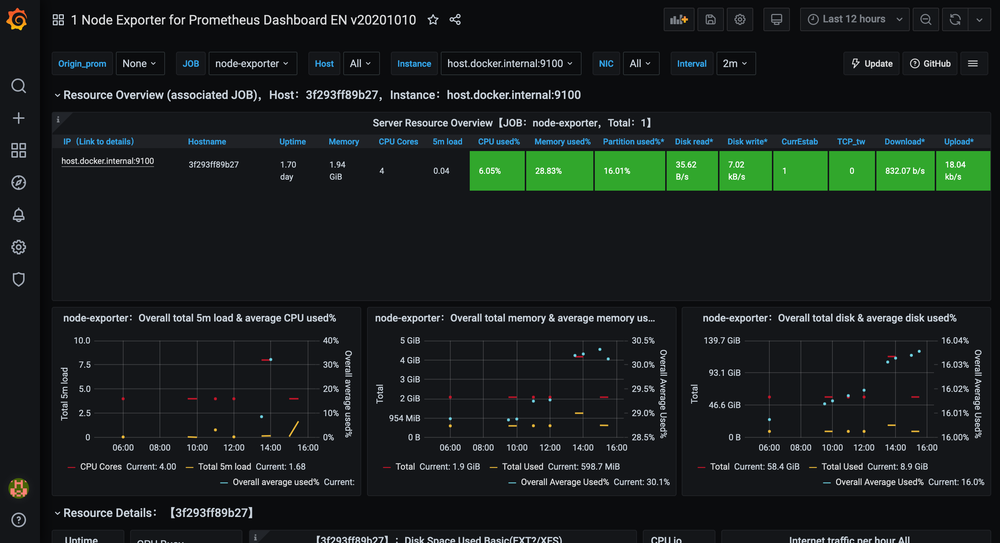

# Prometheus
Basic Node Monitoring with Grafana, Prometheus, and node-exporter.

There are 3 parts
1. Node-Exporter :: Monitor current server status. Run this at each server
2. Promethesus :: Collect data from all node exporters. Run this at some centralized server.
3. Grafana :: Use Data from Prometheus to display. Run this at some centralized server, usually along with Prometheus.

## Node Exporter
This exports metrics on the server. Run one instance of this per server

## Prometheus
This collects data from node-exporter and displays at server.

Edit `prometheus.yml` to collect data from the servers

## Grafana
Display data collected from Prometheus. Login with user `admin` and password specified in `docker-compose.yml`

### Create Data Source
1. Create prometeus data source. (Gear Icon on the left + Data Source)
2. Click "Add Data Source" 
3. Choose Prometheus
4. Enters url `http://prom:9090` -- Matching the name defined in compose file

### Import Dashboard
1. Import dashboard from Json (Plus icon on left + Import)
2. Upload JSON file : Choose `node-exporter-for-prometheus-dashboard.json` from this repo
3. Under Metrics, select the data source

## Ref
* https://www.robustperception.io/understanding-machine-cpu-usage
